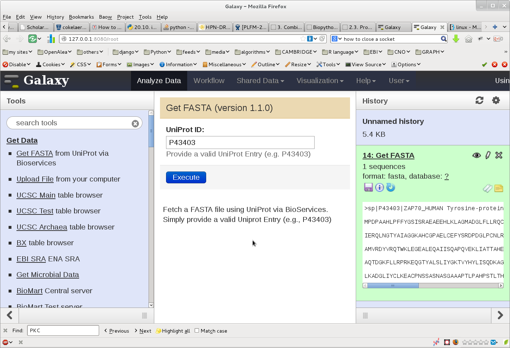

Galaxy
=========

:URL: http://wiki.galaxyproject.org/FrontPage
:Date: Aug 2013

Galaxy is an open, web-based platform for accessible, reproducible, and transparent computational biomedical research.
It provides worflows and plugins to many web resources. 

This tutorial shows how to link bioservices and galaxy. Our tutorial will
provide a plugin to Galaxy so that a user can retrieve a FASTA file via
BioServices and the wrapping of UniProt Web Services. 

We assume that you installed Galaxy on your system via the source code::

    hg clone https://bitbucket.org/galaxy/galaxy-dist/
    cd galaxy-dist
    hg update stable

The tree directory should therefore contains a directory called **tools/** and in
the main directory, an XML file called **conf_tools.py**

We will first create a plugin for bioservices. This is done by adding a
directory called bioservices in ./tools::

    mkdir tools/bioservices

In this directory, we will create two files called **uniprot.py** that
will contain the actual code that calls bioservices and a second XML file that will
allows us to design the plugin layout.

Let us start with the plugin. It is very simple since only the UniProt Entry is
required. The output will simply be the FASTA file that would have been fetched. 

The XML file is:

.. literalinclude:: galaxy/uniprot.xml
    :language: xml

The python code will take as an input the UniProt ID and create a file that
contains the FASTA data:

.. literalinclude:: galaxy/uniprot.py
    :language: python
    :lines: 16-36

finally, you need to make Galaxy aware of this new plugin. this is done in the
file called conf_tool.xml. Add bioservices plugin. The beginning of the file
should look like::

    <?xml version="1.0"?>
     <toolbox>
       <section name="Get Data" id="getext">
         <tool file="bioservices/uniprot.xml"/>
         <tool file="data_source/upload.xml"/>
    ...

Once done. start you galaxy server. The following image show the outcome: in the
left hand side, you can select the bioservices plugin. Then, in the center, you
can enter a uniprot entry. Press the execute button and the new file should
appear in the right hand side. From there you can use Galaxy other tools to
analyse the file. 

This example shows that it is possible to link Galaxy and BioServices to access
to various Web Services that are available through Bioservices. 
