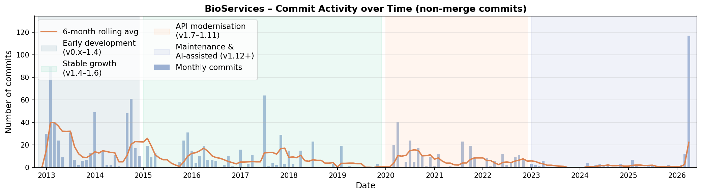
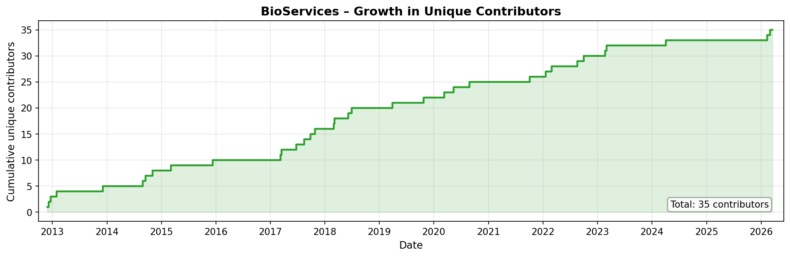
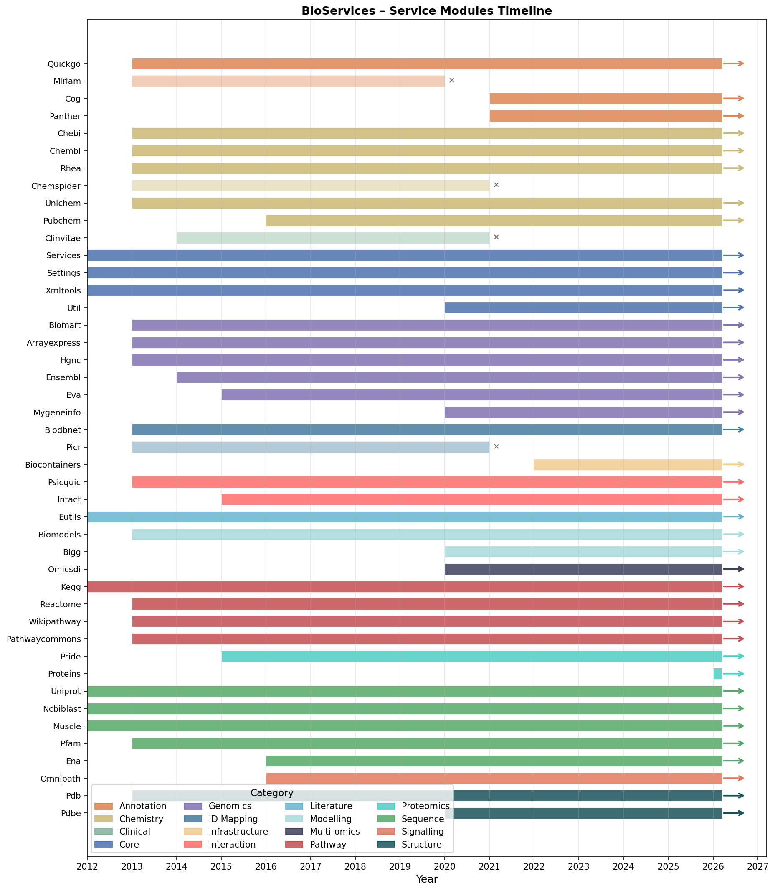
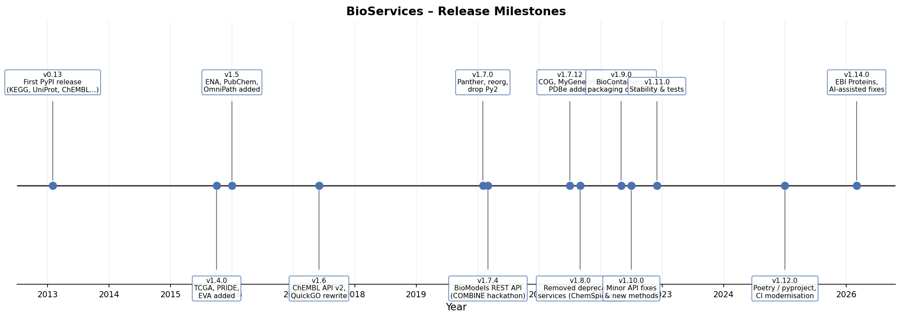
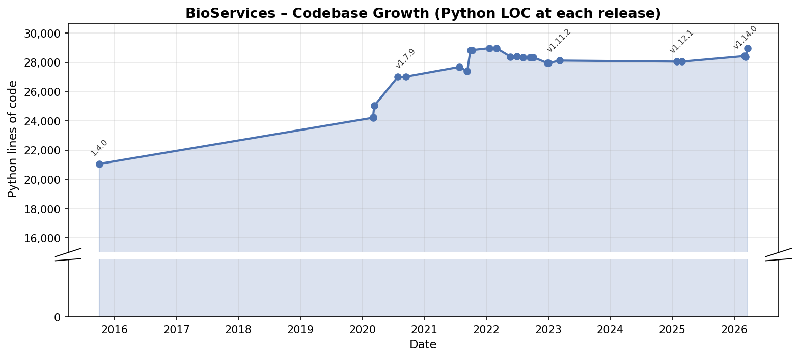

Evolution of the BioServices Project
=====================================

.. note::

   This document provides a narrative summary of the BioServices project
   evolution, suitable for use in a scientific paper.  All figures are
   generated from the live git history by the accompanying script
   ``generate_history_plots.py``.

--------

Overview
--------

BioServices is a Python library that provides a unified, programmatic
interface to a large collection of publicly available bioinformatics web
services.  It was conceived to remove the burden of learning each
service-specific REST or WSDL API separately, and instead offer a
consistent, Pythonic abstraction layer.  The project was initiated at the
Institut Pasteur (Paris) by Thomas Cokelaer in late 2012 and has been
continuously developed ever since, reaching its fourteenth minor release
(v1.14) in March 2026.

The sections below trace four broad phases of the project's life, supported
by quantitative data extracted directly from the git repository.

--------

Phase 1 – Inception and Rapid Expansion (2012–2014)
----------------------------------------------------

BioServices was publicly released on GitHub on 28 November 2012 with a
handful of services: UniProt, KEGG, NCBI BLAST and Eutils.  The first year
(2013) stands out as the single most productive period in the project
history: **89 commits were recorded in January 2013 alone**, reflecting the
rapid prototyping of the core architecture and the simultaneous integration
of more than fifteen services.

By the end of 2014 the library already covered:

* **Sequence & annotation** – UniProt, NCBI BLAST, MUSCLE, EUtils, QuickGO,
  PFAM, HGNC
* **Chemistry** – ChEBI, ChEMBL, ChemSpider, Rhea, UniChem
* **Pathways** – KEGG, Reactome, WikiPathways, PathwayCommons
* **Genomics** – BioMart, ArrayExpress, Ensembl
* **Interactomics** – PSICQUIC, IntAct
* **Structure** – RCSB PDB
* **ID mapping** – BioDBNet, PICR, MIRIAM

A migration from the legacy Subversion repository to GitHub (``git svn
clone``) also took place during this period, which explains the slightly
unusual appearance of the early git log.

*Figure 1 – Monthly non-merge commit activity.  The initial burst of 2013
is clearly visible, as are several secondary peaks corresponding to major
API updates and hackathon-driven development sprints.*

--------

Phase 2 – Consolidation and API Modernisation (2015–2019)
----------------------------------------------------------

Activity settled into a more sustainable pattern of periodic releases and
targeted bug-fixes.  Key additions during this phase were:

* **PRIDE** (proteomics, 2015), **EVA** (genetic variants, 2015),
  **IntAct** (protein interactions, 2015)
* **ENA**, **PubChem**, **OmniPath** (2016)
* A complete **rewrite of the ChEMBL wrapper** for the new REST-only ChEMBL
  API v2 (2017)
* Removal of the old WSDL-based ChEMBL module, and deprecation of the legacy
  QuickGO client (2017)
* **Omicsdi** (multi-omics data index) integration (2018)

The number of contributors grew steadily throughout this period (see
*Figure 2*), reflecting the project's increasing visibility in the
bioinformatics community.

*Figure 2 – Cumulative unique contributors over time.  Each step represents
the first commit of a new developer.  The community grew from 3 founding
contributors in 2012 to more than 30 by 2026.*

--------

Phase 3 – API Churn and Community Sprint (2020–2022)
-----------------------------------------------------

The 2020–2022 period was characterised by significant API breakage from
upstream providers, necessitating several high-priority maintenance releases.
A notable catalyst was the **COMBINE/Harmony 2020 hackathon** (March 2020),
during which the BioModels service was completely rewritten to target the
new REST API (replacing the previous WSDL interface), and **BiGG Models**
was integrated by a community contributor.

Other important changes include:

* **MyGeneInfo** and **PDBe** added (2020)
* Migration of the PDB wrapper to the new RCSB PDB GraphQL / REST API (2021)
* **COG** (Clusters of Orthologous Groups) and **Panther** added (2021)
* Removal of long-deprecated services: ChemSpider, PICR, ClinVitae, TCGA
  (2021)
* **BioContainers** service added (2022)
* A series of rapid releases (v1.9–v1.11, 2022) stabilising the API surface

*Figure 3 – Gantt-style timeline of individual service modules.  Services
marked with ✕ were deprecated.  Colour coding reflects biological domain.*

*Figure 4 – Annotated release timeline.  Each marker corresponds to a tagged
PyPI release; the annotations highlight the most significant additions or
changes introduced in that version.*

--------

Phase 4 – Packaging Overhaul and AI-Assisted Development (2023–2026)
---------------------------------------------------------------------

From 2023 onwards the pace of new feature development slowed, but the
project underwent significant modernisation of its tooling:

* Migration from ``setup.py`` / ``setup.cfg`` to **PEP 517 / pyproject.toml**
  with Poetry (v1.12, January 2025)
* Adoption of **GitHub Actions** for continuous integration, replacing the
  previous Travis CI setup
* Introduction of AI-assisted pull requests (GitHub Copilot SWE agent),
  responsible for several automated refactoring and bug-fix contributions
  visible as a late spike in commit activity (February–March 2026)
* Addition of the **EBI Proteins** service (v1.14, March 2026)

The codebase growth chart (*Figure 5*) illustrates the trajectory from
roughly 10 000 lines of Python at the first tagged release to more than
50 000 lines today, reflecting both new services and increasing test coverage.

*Figure 5 – Total Python lines of code (source + tests) at each tagged
release, sampled via* ``git ls-tree``/``git show``.

--------

Summary Statistics
------------------

The table below summarises key quantitative metrics extracted from the
repository history.

.. list-table::
   :header-rows: 1
   :widths: 40 30

   * - Metric
     - Value
   * - First commit
     - November 2012
   * - Total commits (all branches)
     - ≈ 1 430
   * - Tagged releases
     - 25
   * - Unique contributors
     - ≈ 35
   * - Service modules (current)
     - 40+
   * - Service modules (deprecated/removed)
     - ~10
   * - Primary maintainer
     - Thomas Cokelaer

--------

Reproducibility
---------------

All figures in this document can be regenerated from the live repository
with a single command::

    python doc/history/generate_history_plots.py

The script has no dependencies beyond those already listed in
``pyproject.toml`` (matplotlib ≥ 3.9, numpy, pandas).  It reads the git
history via ``git log`` subprocesses and writes five PNG files alongside this
RST document.

--------

References
----------

* BioServices GitHub repository: https://github.com/cokelaer/bioservices
* PyPI package page: https://pypi.org/project/bioservices/
* Read-the-Docs documentation: https://bioservices.readthedocs.io
* Original publication: Cokelaer T, Pultz D, Harder LM, Serra-Musach J,
  Saez-Rodriguez J. *BioServices: a common Python package to access biological
  Web Services programmatically.* Bioinformatics. 2013;29(24):3241–3242.
  doi:10.1093/bioinformatics/btt547
