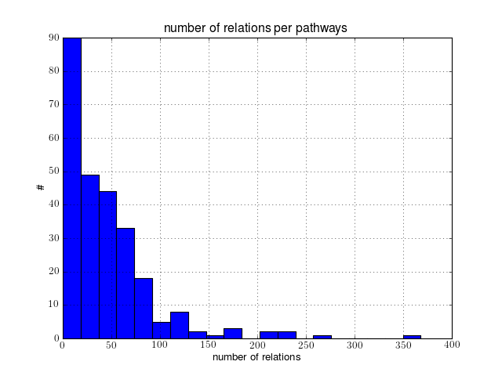

.. contents::

.. _kegg_tutorial:

KEGG Tutorial
==============

Introduction
--------------
Start a kegg interface (default organism is human, that is called **hsa**):

.. doctest::

    from bioservices.kegg import KEGG
    k = KEGG()

KEGG has many databases. The list can be found in the attribute
:attr:`bioservices.kegg.KEGG.databases`. Each database can be
queried with the :meth:`bioservices.kegg.KEGG.list` method::

    k.list("organism")

The output contains Id of the organism and some other information. To retrieve
the Ids, you will need to process the output. However, we provide an alias::

    print(k.organismIds)

In general, methods require an access to the on-line KEGG database
therefore it takes time. For instance, the command above takes a couple of
seconds. However, some are buffered so next time you call it, it will be much faster.

Another useful alias is the **pathwayIds** to retrieve all pathway Ids. However,
you must first specify the organism you are interested in. From the command above
we know that **hsa** (human) is valid organism Id, so let us set it and then get
the list of pathways::

    k.organism = "hsa"
    k.pathwayIds

Another function provided by the KEGG API is the
:meth:`bioservices.kegg.KEGG.get` one that query a specific entry. Here we are
interested into the human gene with the code 7535::

    k.get("hsa:7535")    #hsa:7535 is also known as ZAP70

It is quite verbose and is a single string, which may be tricky to handle. We
provide a tool to ease the parsing (see below and :meth:`bioservices.kegg.KEGG.parse`) returned by :meth:`bioservices.kegg.KEGG.parse`.

Searching for an organism
---------------------------

The method :meth:`bioservices.kegg.KEGG.find` is quite convenient to search for
entries in different database. For instance, if you want to know the code of
an entry for the gene called ZAP70 in the human organism, type::

    >>> s.find("hsa", "zap70")
    'hsa:7535\tZAP70, SRK, STCD, STD, TZK, ZAP-70; zeta-chain (TCR) associated protein kinase 70kDa (EC:2.7.10.2); K07360 tyrosine-protein kinase ZAP-70 [EC:2.7.10.2]\n'

It is quite powerful and more examples will be shown. However, it has some limitations.
For example, what about searching for the organism Ids that correspond to any
Drosophila? It does not look like it is possible. BioServices provides a method to search 
for an organism Id using :meth:`~bioservices.kegg.KEGG.lookfor_organism` given
the name (or part of it)::

    >>> k.lookfor_organism("droso")
    ['T00030 dme Drosophila melanogaster (fruit fly) Eukaryotes;Animals;Arthropods;Insects',
    'T01032 dpo Drosophila pseudoobscura pseudoobscura Eukaryotes;Animals;Arthropods;Insects',
    'T01059 dan Drosophila ananassae Eukaryotes;Animals;Arthropods;Insects',
    'T01060 der Drosophila erecta Eukaryotes;Animals;Arthropods;Insects',
    'T01063 dpe Drosophila persimilis Eukaryotes;Animals;Arthropods;Insects',
    'T01064 dse Drosophila sechellia Eukaryotes;Animals;Arthropods;Insects',
    'T01065 dsi Drosophila simulans Eukaryotes;Animals;Arthropods;Insects',
    'T01067 dwi Drosophila willistoni Eukaryotes;Animals;Arthropods;Insects',
    'T01068 dya Drosophila yakuba Eukaryotes;Animals;Arthropods;Insects',
    'T01061 dgr Drosophila grimshawi Eukaryotes;Animals;Arthropods;Insects',
    'T01062 dmo Drosophila mojavensis Eukaryotes;Animals;Arthropods;Insects',
    'T01066 dvi Drosophila virilis Eukaryotes;Animals;Arthropods;Insects']

Look for pathways (by name)
------------------------------------

Searching for pathways is quite similar. You can use the **find** method as
above::

    >>> print(s.find("pathway", "B+cell"))
    path:map04112   Cell cycle - Caulobacter
    path:map04662   B cell receptor signaling pathway
    path:map05100   Bacterial invasion of epithelial cells
    path:map05120   Epithelial cell signaling in Helicobacter pylori infection
    path:map05217   Basal cell carcinoma

Note that without the + sign, you get all pathway that contains *B* or *cell*.
Yet, we have 5 results, which do not neccesseraly fit our request. Alternatively
you can use one of BioServices method::

    >>> k.lookfor_pathway("B cell")
    ['path:map04662 B cell receptor signaling pathway']

You can also search for a pathway knowing some gene names but first we need to
introspect the pathway to get the genes IDs.

Look for pathway (by genes i.e., IDs or usual name)
--------------------------------------------------------

Imagine you want to find the pathway that contains **ZAP70**. As we have seen
earlier you can get its gene Id as follows::

    >>> s.find("hsa", "zap70")
    hsa:7535

The following commands do not help::

    >>> s.find("pathway", "zap70")
    >>> s.find("pathway", "hsa:7535")
    >>> s.find("pathway", "7535")

We provide a method to search for pathways that contain the required gene Id.
You can search by KEGG Id or gene name::

    >>> res = s.get_pathway_by_gene("7535", "hsa")
    >>> s.get_pathway_by_gene("zap70", "hsa")
    ['path:hsa04064', 'path:hsa04650', 'path:hsa04660', 'path:hsa05340']

This commands first search for the gene Id in the KEGG database and then parse
the output to retrieve the pathways.

Introspecting a pathway
--------------------------

Let us focus on one pathway ( **path:hsa04660**). You can use the :meth:`get`
command to obtain information about the pathway. ::

    print(s.get("hsa04660"))

The output is a single string where you can recognise different fields such as 
NAME, GENE, DESCRIPTION and so on. This is quite limited. In BioServices, we provide a convenient parser that converts the output of the previous command into a dictionary::

    >>> s = KEGG()
    >>> data = s.get("hsa04660")
    >>> dict_data = s.parse(data)
    >>> print(dict_data['GENE'])
    '10000': 'AKT3; v-akt murine thymoma viral oncogene homolog 3 (protein kinase B, gamma) [KO:K04456] [EC:2.7.11.1]',
    '10125': 'RASGRP1; RAS guanyl releasing protein 1 (calcium and DAG-regulated) [KO:K04350]',
    '1019': 'CDK4; cyclin-dependent kinase 4 [KO:K02089] [EC:2.7.11.22]',
    ...

This is fine if we just want the name of the genes but what about their
relations? Actually, there is an option with the get method where you can
specify the output format. In particular you can request the pathway to be
returned as a kgml file::

    res = s.get("hsa04660", "kgml")

This file can be parsed to extract the relations. We provide a tool to do that::

    res = s.parse_kgml_pathway("hsa04660")

The variable returned is a dictionary with 2 keys: "entries" and "relations".

You can extract the relations as follows::

    res['relations']

It is a list of relations, each relation being a dictionary::

    >>> res['relations'][0]
    {'entry1': u'61',
     'entry2': u'63',
     'link': u'PPrel',
     'name': u'binding/association',
     'value': u'---'}

Here entry1 and 2 are Ids. The Ids can be found in ::

    res['entries']

From there you should consult :meth:`bioservices.kegg.KEGG.parse_kgml_pathway`
and the KEGG document for more information. You may also look at 
:meth:`bioservices.kegg.KEGG.pathway2sif` method that extact only protein-protein
interactions with activation and inhibition links only.

Building a histogram of all relations in human pathways
------------------------------------------------------------------

Scanning all relations of the Human organism takes about 5-10 minutes. You can
look at a subset by setting Nmax to a small value (e.g., Nmax=10).

::

    from pylab import *
    # extract all relations from all pathways
    from bioservices.kegg import KEGG
    s = KEGG()
    s.organism = "hsa"

    # retrieve more than 260 pathways so it takes time
    results = [s.parse_kgml_pathway(x) for x in s.pathwayIds] 
    relations = [x['relations'] for x in results]

    hist([len(r) for r in relations], 20)
    xlabel('number of relations')
    ylabel('\#')
    title("number of relations per pathways")
    grid(True)

You can then extract more information such as the type of relations::

    >>> # scan all relations looking for the type of relations
    >>> import collections # for python 2.7.0 and above

    >>> # we extract from all pathways, all relations, where we retrieve the type of
    >>> # relation (name)
    >>> data = list(flatten([[x['name'] for x in rel] for rel in relations]))

    >>> counter = collections.Counter(data)
    >>> print(counter)
    Counter({u'compound': 5235, u'activation': 3265, u'binding/association': 1087,
    u'phosphorylation': 940, u'inhibition': 672, u'indirect effect': 559,
    u'expression': 542, u'dephosphorylation': 93, u'missing interaction': 80,
    u'dissociation': 78, u'ubiquitination': 48, u'state change': 24, u'repression':
    12, u'methylation': 2})

.. Access to compound, reactions, ko, drugs...
   --------------------------------------------

.. This example uses the NFkB signalling pathway. Let us search for its id within
    the database using the :meth:`lookfor_pathway` command::
    >>> k.lookfor_pathway("NF")
    [<SOAPpy.Types.structType item at 98402888>: {'definition': 
        'NF-kappa B signaling pathway - Homo sapiens (human)', 'entry_id': 'path:hsa04064'},
     <SOAPpy.Types.structType item at 98450176>: {'definition': 
        'Vibrio cholerae infection - Homo sapiens (human)', 'entry_id': 'path:hsa05110'},
    ...
    The first pathway is the one we are looking for. Its entry_id is
    "path:hsa04064". Now, we can obtain a list of genes ids corresponding to this
    pathway::
    >>> pw = k.lookfor_pathway("NF")[0]
    >>> pid = pw.entry_id
    >>> genes = k.get_genes_by_pathway(pid)
    >>> len(genes)
    93
    If you do not know the name of a pathway but know some species in it (given
    their name, not kegg id), then you can use the following command::
     >>> k.lookfor_specy("ZAP70")
    'hsa:7535'
    >>> k.get_pathways_by_genes("hsa:7535")
    ['path:hsa04064', 'path:hsa04650', 'path:hsa04660', 'path:hsa05340']
    You can see the pathway "path:hsa04064"  (NF-kappaB).
    From a pathway, you can obtain the number of compounds:: 
    >>> compounds = k.get_compounds_by_pathway(pid)
    >>> print(compounds)
    ['cpd:C00076', 'cpd:C00165', 'cpd:C01245']
    Now, you may want to do the inverse and search for pathways that contains these
    compounds::
    >>> k.get_pathways_by_compounds(['cpd:C00076', 'cpd:C00165', 'cpd:C01245'])
     ['path:ko04010', 'path:ko04012', 'path:ko04020', 'path:ko04062',
    'path:ko04064', 'path:ko04066', 'path:ko04070', 'path:ko04270', 'path:ko04370',
    'path:ko04540', 'path:ko04650', 'path:ko04660', 'path:ko04662', 'path:ko04664',
    'path:ko04666', 'path:ko04720', 'path:ko04722', 'path:ko04723', 'path:ko04724',
    'path:ko04725', 'path:ko04726', 'path:ko04728', 'path:ko04730', 'path:ko04745',
    'path:ko04912', 'path:ko04916', 'path:ko04961', 'path:ko04970', 'path:ko04971',
    'path:ko04972', 'path:ko05143', 'path:ko05146', 'path:ko05200', 'path:ko05214',
    'path:ko05223']
    There are quite a few pathways containing these compounds, in particular **path:ko04064**, which can be visualized::
    k.view_pathways(["path:ko04064"])
    The pathway **path:hsa04064** does not contain drugs or reactions. If you consider **path:hsa00010** you could also use more functions to retrieve elements::
    >>> reactions = k.get_reactions_by_pathway("path:hsa00010")
    >>> drugs = k.get_drugs_by_pathway("path:hsa00010")
    >>> enzymes = k.get_enzymes_by_pathway("path:hsa00010")
    >>> glycans = k.get_enzymes_by_pathway("path:hsa00010") # nothing
    and conversely::
    >>> k.get_pathways_by_reactions(reactions)
    ['path:rn00010']
    >>> k.get_pathways_by_enzymes(['path:map00010'])
    ['path:map00010']
    .. note:: not that the pathway name is now rn00010 or map00010, dr:D00010but it corresponds to
    hsa00010. rn stands for reactions, map for enzymes ??.
    .. note:: get_pathways_by_drugs does not seem to work.

.. Notes about KO
    ------------------
    KO stands for KEGG Orthology, several methods are available::
    >>> kos = k.get_kos_by_pathway(pid)
    >>> ko = kos[0] # ko:K01116
    >>> k.get_genes_by_ko(ko, "hsa").entry_id
    ["hsa:5335"]
    >>> k.get_ko_by_gene("hsa:5335")
    ['ko:K01116']
    >>> k.serv.get_ko_by_ko_class("00903", "hsa",1,100)
    Drugs
    ---------------
    Some pathways contains drugs::
    >>> k.get_drugs_by_pathway("path:hsa00010")
    ['dr:D00009', 'dr:D00010', 'dr:D00068', 'dr:D02798', 'dr:D04855', 'dr:D06542']
    From the Drug Ids, you can get information::
    >>> data = k.bget("dr:D00009") # gives you information
    # we see that its name is d-glucose, its mass is around180.15
    # Given the name, you can get the drug id. 
    You have also search drugs by name or  mass::
    >>> k.serv.search_drugs_by_name("d-glucose")
    ['dr:D00009', 'dr:D02325']
    # and check its mass or find drugs with similar mass
    >>> k.search_drugs_by_mass(180,.2)
    ['dr:D00009', 'dr:D00109', 'dr:D00114', 'dr:D00371', 'dr:D01195',
    'dr:D01422', 'dr:D03201', 'dr:D04291', 'dr:D05033', 'dr:D06055', 'dr:D08079',
    'dr:D08482', 'dr:D09007', 'dr:D09924']
    You can also obtain the drug Ids in other databases::
    >>> drugs = k.get_drugs_by_pathway("path:hsa00010")
    ['dr:D00009', 'dr:D00010', 'dr:D00068', 'dr:D02798', 'dr:D04855','dr:D06542']
    >>> print(k.bconv("dr:D00010"))

