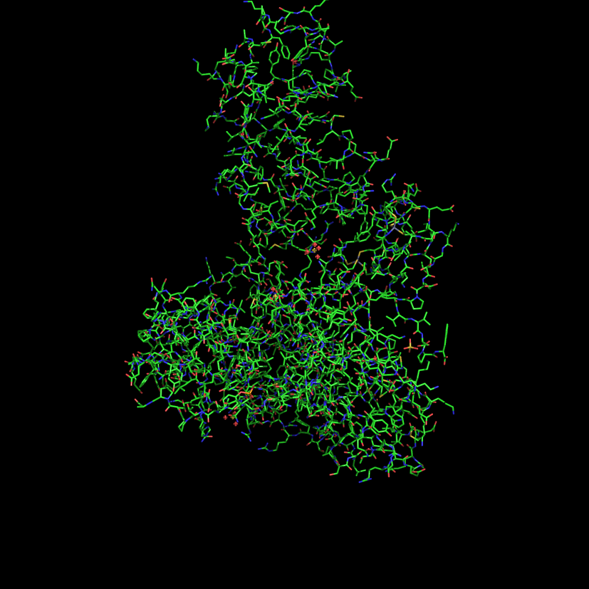

PYMOL
=========

:URL: http://www.pymol.org/

This example below uses the external software called PyMOL. We have installed it
without trouble by downloading the source file from their website. Then, we
typed those commands in a shell::

    bunzip pymol-v1.6alpha1.tar.bz2
    tar xvf pymol-v1.6alpha1.tar
    cd pymol
    python setup.py install

You may need to install library if requested. Tested under Fedora 15.

The following code uses BioServices to get the PDB Identifier of a protein
called ZAP70. To do so, we use :class:`bioservices.uniprot.UniProt` to get its accession number (P43403) and its
PDB identifer. Then, we use :class:`bioservices.pdb.PDB` to get the 3D structure in PDB
format. 

.. literalinclude:: pymol_app.py
    :language: python
    :linenos:
    :emphasize-lines: 8,15,26

The script above uses PyMOL in a script manner to save the 3D graphical representation of the protein (here below) but you could also
use PyMOL in an interactive mode.

